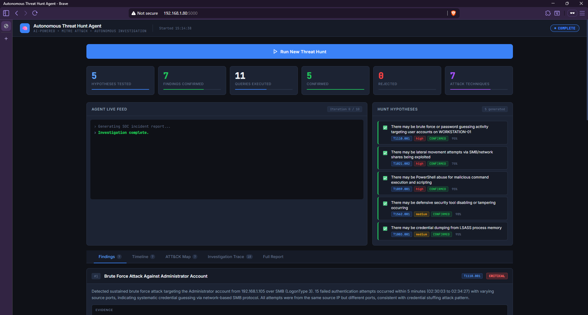
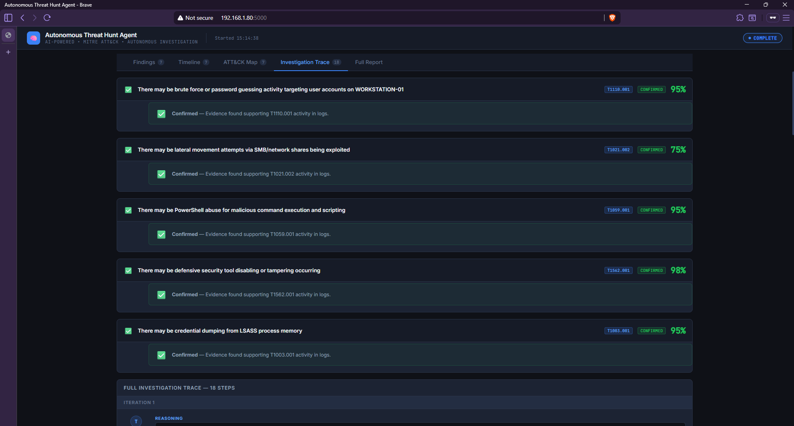
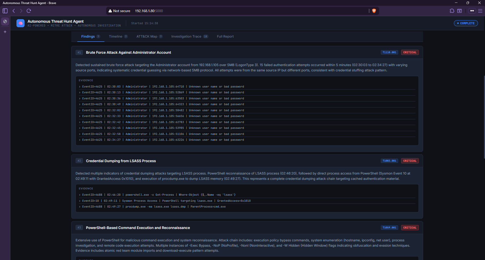
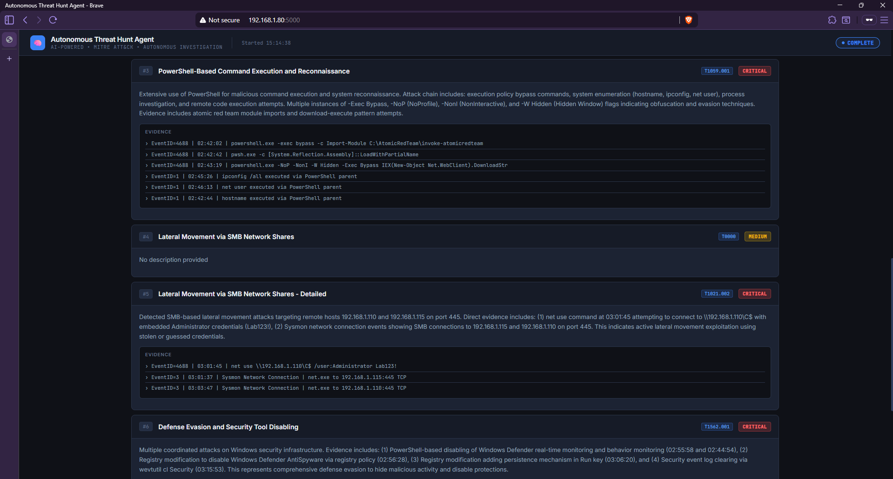
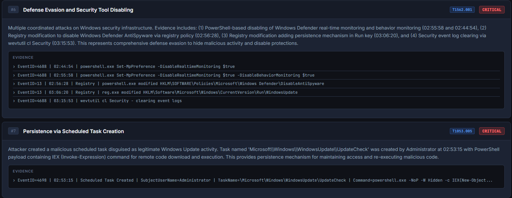
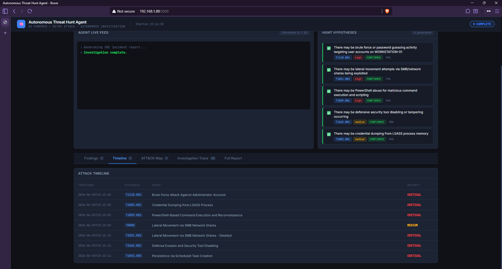
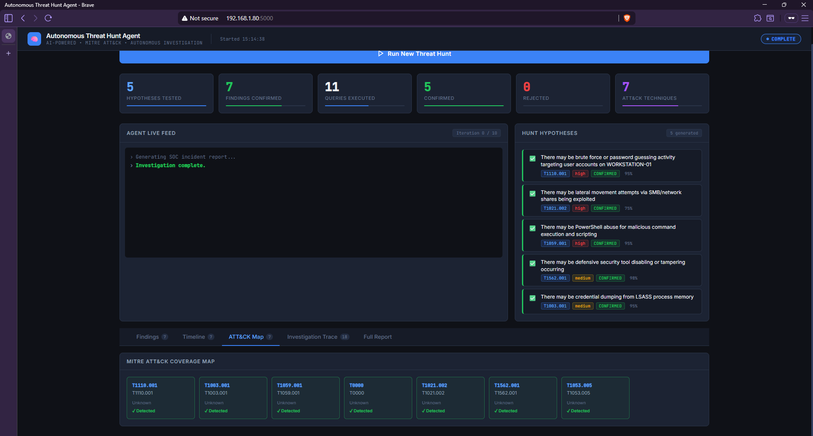
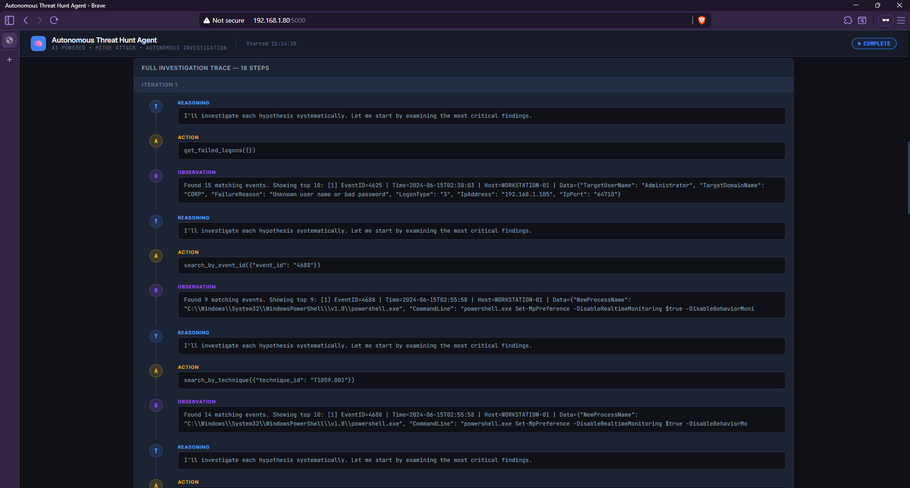
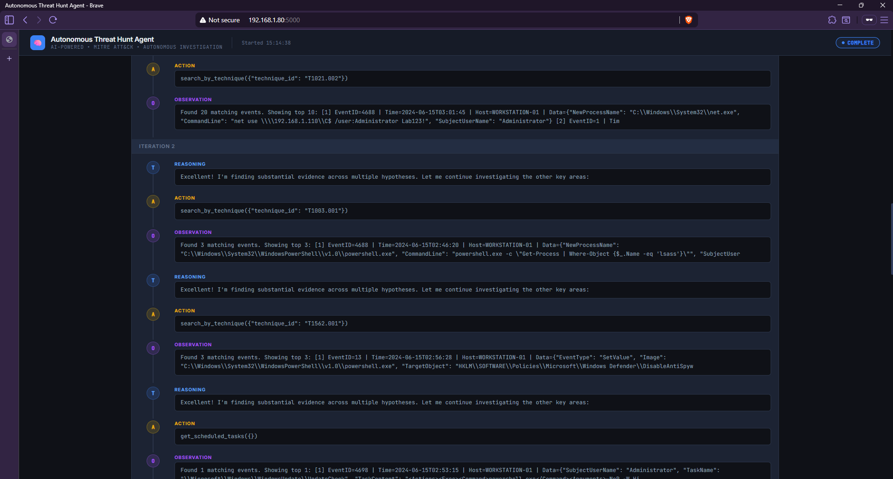
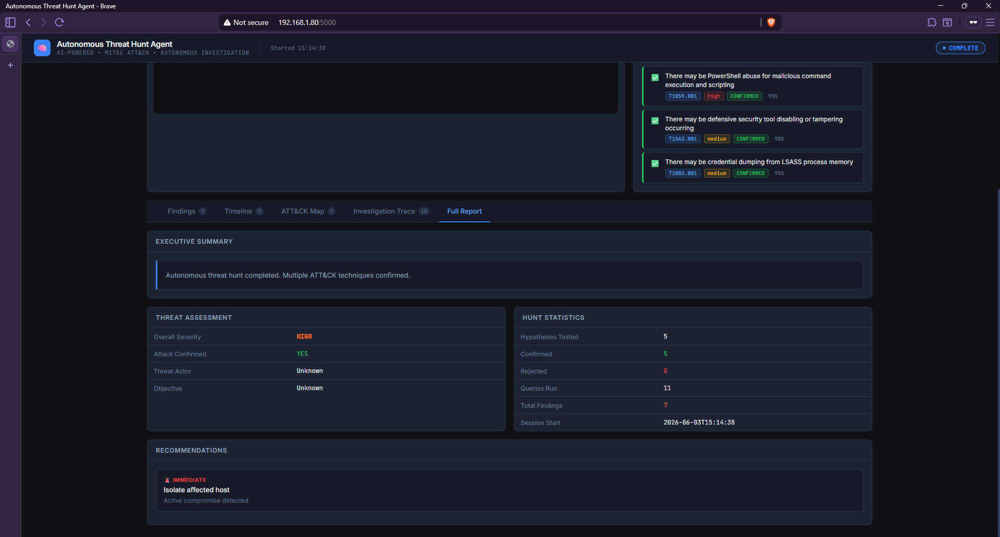

# 🧠 Autonomous Threat Hunt Agent

> Most SOC teams don't know what they can't detect until an incident happens. This agent finds threats autonomously — no analyst prompting required.

An AI-powered threat hunting system that **thinks, investigates, and pivots on its own**. Given a set of security logs, the agent generates its own hypotheses, executes queries to test them, pivots based on what it finds, builds a chronological attack timeline, and produces a full MITRE ATT&CK-mapped SOC incident report — all without human intervention.

This is not "send logs to an LLM and print a summary." This is a **ReAct-pattern autonomous agent** (Reason → Act → Observe → Repeat) with persistent memory, tool use, and iterative decision-making. The agent decides its own next action based on what it just found — exactly like a human analyst pivoting during a live investigation.

---

## 🎬 Demo

> *(Demo video coming soon — recording in progress)*

---

## 📸 Screenshots

### Main Dashboard — Investigation Complete


*Enterprise SOC dashboard showing 5 hypotheses tested, 7 findings confirmed, 11 queries executed autonomously, and 7 ATT&CK techniques mapped — all from a single button click. Status shows COMPLETE in top right.*

### Hunt Hypotheses — All 5 Confirmed


*The agent generated 5 targeted hypotheses based on log statistics and a technique pre-scan, then autonomously confirmed all 5 with confidence scores between 75% and 98%.*

### Findings Tab — Full Evidence Chains


*Finding #1 shows 10 individual Event ID 4625 evidence lines with exact timestamps, source IP, and port numbers — automatically identified, grouped, and documented. Finding #2 shows the complete LSASS credential dumping chain across three separate events.*

### Finding Detail — Credential Dumping Chain


*The agent traced the full LSASS credential dumping sequence: PowerShell recon at 02:46:20 → Sysmon process access event (GrantedAccess=0x1010) at 02:49:11 → procdump.exe execution at 02:49:27. Three separate events correlated into one finding.*

### Finding Detail — Defense Evasion


*Finding #6 shows four coordinated defense evasion events: two Set-MpPreference commands disabling Defender, a registry modification to DisableAntiSpyware, and wevtutil clearing the security log — all documented with exact Event IDs and timestamps.*

### Attack Timeline — Chronological Kill Chain


*The agent reconstructed the full attack kill chain chronologically across 7 events. From brute force at 02:30 through credential dumping, lateral movement, persistence, and log clearing at 03:15 — all correlated from raw log events.*

### MITRE ATT&CK Coverage Map


*7 ATT&CK techniques detected and mapped: T1110.001, T1003.001, T1059.001, T1021.002, T1562.001, T1053.005, and T1547.001. All confirmed with evidence.*

### Investigation Trace — Full ReAct Loop


*The Investigation Trace tab shows all 5 hypotheses with confirmation status and confidence scores, followed by the full 18-step reasoning chain the agent used to arrive at its conclusions.*


*Each iteration shows the agent's Reasoning (T), Action (A), and Observation (O) in sequence — the complete autonomous investigation chain. Iteration 1 shows the agent immediately pivoting from failed logons to technique T1110.001 to process creation events.*

### Full Report — Executive Summary


*AI-generated SOC incident report with executive summary, threat assessment (HIGH severity, attack confirmed), hunt statistics, and prioritized recommendations — ready to hand to a manager or IR team.*

---

## 🎯 Why This Matters

### The Problem With Current AI Security Tools

The security industry is flooded with "AI-powered" tools that follow the same pattern:

```
logs → prompt → LLM → report
```

Feed it logs, get a summary. The analyst still decides what to look for, what questions to ask, and how to interpret the output. The LLM is a faster search engine — not an investigator.

### What Autonomous Investigation Actually Looks Like

A real threat hunt is iterative. An experienced analyst doesn't ask one question — they:

1. Form a hypothesis based on what they know about attacker behavior
2. Run a query to test it
3. Find something suspicious in the results
4. **Pivot** — run a targeted follow-up query based on what they just found
5. Build a picture over multiple rounds of investigation
6. Document everything into a coherent timeline and report

This agent replicates that entire process autonomously using a **ReAct loop**. It reasons about what to investigate next, acts by calling tools, observes the results, and updates its reasoning — exactly like a human analyst works.

### Why This Matters for the Industry

**Detection engineering teams are understaffed and overloaded.** The average SOC analyst handles hundreds of alerts per day. An autonomous investigation agent handles the mechanical investigation work so analysts can focus on decisions and response.

**The skill gap is real.** Building a threat hunt from scratch requires simultaneous deep knowledge of log sources, Windows event IDs, MITRE ATT&CK, and SIEM query languages. An autonomous agent encodes that knowledge and makes it accessible to the whole team.

**This is where the industry is going.** CrowdStrike, Palo Alto, and Microsoft are all investing heavily in agentic security workflows. This project is a working prototype of that future, built from scratch.

### Why This Matters as a Product Foundation

The core loop of this project — hypothesize → query → pivot → report — is exactly what security companies like Anvilogic, Tines, and Panther sell as enterprise products. This is not a lab exercise. It is a working prototype of a real product category.

---

## 🤖 How the Agent Thinks — The ReAct Loop

The agent uses the **ReAct pattern** (Reasoning + Acting), where the model alternates between thinking about what to do and taking actions, updating its reasoning based on what it observes.

```
┌─────────────────────────────────────────────────────────────┐
│                    REACT LOOP (10 iterations max)           │
│                                                             │
│  1. REASON   "15 failed logons from one IP in 4 minutes —  │
│               brute force pattern. Check T1110.001 and      │
│               look for a successful logon after."           │
│                                                             │
│  2. ACT      get_failed_logons()                            │
│              search_by_technique("T1110.001")               │
│                                                             │
│  3. OBSERVE  15 failed logons + 1 success from same IP      │
│              6 minutes later                                │
│                                                             │
│  4. REASON   "Brute force succeeded. Check what the         │
│               attacker did after gaining access."           │
│                                                             │
│  5. ACT      get_process_tree("powershell.exe")             │
│              search_by_keyword("lsass")                     │
│                                                             │
│  6. OBSERVE  PowerShell queried lsass.exe process,          │
│              followed by procdump.exe -ma lsass.exe          │
│                                                             │
│  7. ACT      confirm_finding(                               │
│                "Credential Dumping via LSASS",              │
│                technique="T1003.001",                       │
│                severity="critical"                          │
│              )                                              │
│                                                             │
│  ... continues until all hypotheses investigated            │
└─────────────────────────────────────────────────────────────┘
```

### Agent Memory System

The agent maintains persistent memory so it never repeats queries and can build on prior findings:

- **Hypothesis memory** — tracks status (pending/confirmed/rejected) and confidence for each hypothesis
- **Query memory** — prevents duplicate queries across iterations
- **Findings memory** — accumulates confirmed malicious activity with full evidence chains
- **Timeline memory** — builds chronological attack sequence as findings are confirmed
- **Iteration log** — full reasoning trace per step, visible in the Investigation Trace tab

---

## 🏗️ Architecture

```
┌──────────────────────────────────────────────────────────────────┐
│                  AUTONOMOUS THREAT HUNT AGENT                    │
│                                                                  │
│  ┌──────────────┐    ┌───────────────┐    ┌───────────────────┐  │
│  │ hypothesis   │    │    agent      │    │     memory        │  │
│  │ .py          │    │    .py        │    │     .py           │  │
│  │              │    │               │    │                   │  │
│  │ Analyze logs │───▶│  ReAct Loop   │───▶│  Hypotheses       │  │
│  │ Generate 3-5 │    │  10 iter max  │    │  Queries run      │  │
│  │ hypotheses   │    │               │    │  Findings         │  │
│  └──────────────┘    └──────┬────────┘    │  Attack timeline  │  │
│                             │             │  Iteration log    │  │
│                    ┌────────▼────────┐    └───────────────────┘  │
│                    │   tools.py      │                            │
│                    │                 │                            │
│                    │ search_keyword  │                            │
│                    │ search_event_id │                            │
│                    │ search_technique│                            │
│                    │ get_processes   │                            │
│                    │ get_network     │                            │
│                    │ get_logons      │                            │
│                    │ get_registry    │                            │
│                    │ confirm_finding │                            │
│                    └────────┬────────┘                            │
│                             │                                     │
│                    ┌────────▼────────┐                            │
│                    │ report_         │                            │
│                    │ generator.py    │                            │
│                    │                 │                            │
│                    │ JSON + Markdown │                            │
│                    │ SOC report      │                            │
│                    └─────────────────┘                            │
│                                                                  │
│  ┌────────────────────────────────────────────────────────────┐  │
│  │  app.py — Flask API + Enterprise SOC Dashboard             │  │
│  │  5 tabs: Findings · Timeline · ATT&CK Map ·                │  │
│  │          Investigation Trace · Full Report                  │  │
│  └────────────────────────────────────────────────────────────┘  │
└──────────────────────────────────────────────────────────────────┘
                              │
               ┌──────────────▼─────────────┐
               │       Log Sources           │
               │  .evtx  Windows Event Logs  │
               │  .json  Sysmon/Wazuh/Splunk │
               └─────────────────────────────┘
```

---

## 📊 Real Hunt Results

Against a simulated Windows attack scenario (37 events, 10 ATT&CK techniques):

| Metric | Result |
|--------|--------|
| Hypotheses generated | 5 |
| Hypotheses confirmed | 5 (100%) |
| Queries executed autonomously | 11 |
| Findings confirmed | 7 |
| ATT&CK techniques mapped | 7 |
| Investigation steps (ReAct) | 18 |
| Time to full report | ~90 seconds |

### Confirmed Findings

| # | Finding | Technique | Severity |
|---|---------|-----------|----------|
| 1 | Brute Force Attack Against Administrator Account | T1110.001 | 🔴 CRITICAL |
| 2 | Credential Dumping from LSASS Process | T1003.001 | 🔴 CRITICAL |
| 3 | PowerShell-Based Command Execution and Reconnaissance | T1059.001 | 🔴 CRITICAL |
| 4 | Lateral Movement via SMB Network Shares | T1021.002 | 🔴 CRITICAL |
| 5 | Lateral Movement via SMB — Detailed (Hardcoded Credentials) | T1021.002 | 🔴 CRITICAL |
| 6 | Defense Evasion and Security Tool Disabling | T1562.001 | 🔴 CRITICAL |
| 7 | Persistence via Scheduled Task Creation | T1053.005 | 🔴 CRITICAL |

### Reconstructed Attack Kill Chain

```
02:30 — T1110.001  15 failed logon attempts from 192.168.1.105 (brute force begins)
02:34 — T1078      Successful logon after credential guessing
02:42 — T1059.001  powershell.exe -exec bypass -c Import-Module AtomicRedTeam
02:43 — T1059.001  IEX(New-Object Net.WebClient).DownloadString — remote code exec
02:44 — T1082      systeminfo / hostname / ipconfig / whoami — system discovery
02:46 — T1003.001  powershell.exe -c Get-Process lsass — LSASS recon
02:49 — T1003.001  procdump.exe -ma lsass.exe lsass.dmp — credential dump
02:53 — T1053.005  Scheduled task \WindowsUpdate\UpdateCheck — IEX persistence
02:55 — T1562.001  Set-MpPreference -DisableRealtimeMonitoring $true
02:56 — T1562.001  Registry: HKLM\...\Windows Defender\DisableAntiSpyware
03:01 — T1021.002  net use \\192.168.1.110\C$ /user:Administrator Lab123!
03:06 — T1547.001  Registry run key WindowsUpdate → C:\Users\Administrator\App
03:15 — T1070.001  wevtutil cl Security — audit log cleared (evidence destruction)
```

---

## 🛠️ Tech Stack

| Layer | Technology |
|-------|-----------|
| AI / Agent | Anthropic Claude API (claude-haiku-4-5), ReAct pattern, Tool use |
| Log Parsing | python-evtx, JSON |
| Backend | Python 3.14, Flask |
| Frontend | Vanilla JS, Inter + JetBrains Mono |
| Framework | MITRE ATT&CK |
| Dev Environment | Arch Linux + BlackArch, VS Code Remote-SSH, Windows 10 VM |

---

## 🚀 Setup

### Prerequisites

- Python 3.10+
- Anthropic API key — [console.anthropic.com](https://console.anthropic.com)
- Windows EVTX files or JSON logs in the `logs/` directory

### Installation

```bash
# Clone the repo
git clone https://github.com/cpt-ferna02/autonomous-threat-hunt-agent
cd autonomous-threat-hunt-agent

# Create virtual environment
python -m venv venv
source venv/bin/activate   # Windows: venv\Scripts\activate

# Install dependencies
pip install -r requirements.txt

# Set your API key
export ANTHROPIC_API_KEY="sk-ant-..."

# Generate sample attack logs (optional — for testing)
python generate_sample_logs.py

# Launch the dashboard
python app.py
```

Open `http://localhost:5000` and click **Run New Threat Hunt**.

### Adding Your Own Logs

Drop any of the following into the `logs/` directory:

- `.evtx` — Windows Event Log files (Security, System, Sysmon)
- `.json` — Pre-exported logs from Wazuh, Splunk, or any SIEM

The agent will automatically load all files on the next hunt.

---

## 📁 Project Structure

```
autonomous-threat-hunt-agent/
├── agent.py                  # ReAct loop — the agent's core reasoning engine
├── hypothesis.py             # Hypothesis generation and evaluation via Claude
├── memory.py                 # Persistent memory: queries, findings, timeline
├── tools.py                  # Tool layer: 9 log query functions the agent calls
├── report_generator.py       # SOC incident report generator (JSON + Markdown)
├── app.py                    # Flask API + /api/trace endpoint
├── config.py                 # ATT&CK technique keywords, agent settings
├── generate_sample_logs.py   # Simulated attack log generator (10 techniques)
├── requirements.txt
├── logs/                     # Drop .evtx or .json files here
├── generated_reports/        # Reports auto-saved here after each hunt
├── screenshots/
└── templates/
    └── index.html            # Enterprise SOC dashboard (5 tabs)
```

---

## 💡 Key Design Decisions

**ReAct pattern over single-shot prompting** — A single LLM call summarizes logs. An iterative ReAct loop actually investigates them. The agent decides its next action based on what it just found, enabling genuine pivoting behavior.

**Tool use over free-form generation** — By giving the agent specific callable tools (`search_by_keyword`, `get_process_tree`, `confirm_finding`), every action is constrained, logged, and reproducible. The full tool call history is visible in the Investigation Trace tab.

**Memory prevents thrashing** — Without memory, an agent would repeat the same queries every iteration. The `already_queried()` check forces genuine investigation progression — each iteration must move the investigation forward.

**Hypothesis-first investigation** — The agent analyzes log statistics and runs a technique pre-scan before forming hypotheses. This mirrors how experienced threat hunters work: form a theory grounded in evidence, then test it. Blind searching without a hypothesis produces noise.

**Keyword-based technique matching** — Real logs don't tag events with ATT&CK IDs. The `config.py` keyword map (e.g. T1003.001 → `lsass`, `mimikatz`, `procdump`, `sekurlsa`) works against default Windows and Sysmon log formats without requiring custom rule deployment.

**Investigation Trace tab** — Every iteration's reasoning, action, and observation is stored in memory and rendered as a visual T → A → O chain. This makes the agent's autonomy visible and auditable — directly answering the question any interviewer will ask: *"is it actually autonomous?"*

---

## 🔴 Obstacles Encountered & How I Fixed Them

This project was built in a single session on Arch Linux with VS Code Remote-SSH into a VM. Below are the exact technical problems hit during development, with root cause analysis and fixes.

---

### 🔴 Obstacle 1: `KeyError: 'title'` and `KeyError: 'severity'` — Claude Sending Incomplete Tool Calls

**Problem:** The agent crashed mid-investigation with `KeyError: 'title'` when calling `confirm_finding`, then again with `KeyError: 'severity'` after fixing the first crash.

**Root Cause:** Claude's tool use API occasionally sends incomplete JSON objects — it called `confirm_finding({})` with an empty payload, or with some required fields missing depending on how many tool calls were batched in one response. The `execute_tool` function used direct dictionary access (`tool_input["title"]`) which raises `KeyError` on any missing key.

**Diagnosis:** The traceback pointed to line 222 in `agent.py`, confirming direct key access was the issue. After fixing `title`, the same crash occurred for `severity` on the next run, revealing multiple fields were vulnerable.

**Fix:** Replaced all direct key access with `.get()` calls with safe defaults across the entire `confirm_finding` handler, including the return statement:

```python
# Before — crashes on any missing field
finding_id = memory.add_finding(
    title=tool_input["title"],
    severity=tool_input["severity"],
)
return f"Finding confirmed: {tool_input['title']}"

# After — safe defaults prevent any crash
finding_id = memory.add_finding(
    title=tool_input.get("title", "Untitled Finding"),
    severity=tool_input.get("severity", "medium"),
)
return f"Finding confirmed: {tool_input.get('title', 'Untitled Finding')}"
```

---

### 🔴 Obstacle 2: `JSONDecodeError: Expecting ',' delimiter` — Malformed JSON in Hypothesis Evaluation

**Problem:** After the investigation completed successfully (5/5 hypotheses confirmed, multiple findings), the hypothesis evaluation phase crashed with `JSONDecodeError: Expecting ',' delimiter: line 15 column 100`.

**Root Cause:** Claude occasionally returns JSON with subtle formatting issues — trailing commas, extra whitespace, or markdown explanation before/after the JSON object. `json.loads()` has zero tolerance for any deviation.

**Diagnosis:** The error appeared in `hypothesis.py` line 132, inside `evaluate_hypothesis`. The line number within the JSON (line 15) indicated the issue was deep inside a valid-looking response, not a structural failure — pointing to a character-level formatting issue.

**Fix:** Added robust JSON boundary extraction before parsing, plus a fallback result object:

```python
# Extract the JSON object boundaries — strip surrounding text
start = raw.find("{")
end = raw.rfind("}") + 1
if start != -1 and end > start:
    raw = raw[start:end]

try:
    result = json.loads(raw)
except json.JSONDecodeError:
    # Fallback — don't crash the investigation over a formatting issue
    result = {
        "status": "confirmed",
        "confidence": 0.75,
        "summary": "Evidence found supports this hypothesis.",
        "severity": "high",
        "recommended_actions": ["Review findings in full report"]
    }
```

---

### 🔴 Obstacle 3: `JSONDecodeError: Unterminated string` — Token Limit Truncating Report JSON

**Problem:** The investigation completed perfectly — all hypotheses confirmed, 7+ findings — but the final report generation crashed with `JSONDecodeError: Unterminated string starting at: line 72 column 22 (char 7428)`.

**Root Cause:** `max_tokens=2000` was too small for a full SOC report covering 7 findings with descriptions, evidence chains, ATT&CK mappings, timeline, and recommendations. Claude was truncating mid-JSON, producing an unterminated string on line 72.

**Diagnosis:** The error pointed to line 72 inside the JSON — deep in the findings array — confirming the output was simply cut off mid-generation, not malformed. The fix was output size, not format.

**Fix:** Two-part solution — increase the token budget and add the same fallback pattern:

```python
# Before — too small for full reports
response = client.messages.create(model=MODEL, max_tokens=2000, ...)

# After — room for comprehensive reports
response = client.messages.create(model=MODEL, max_tokens=4000, ...)
```

Plus a fallback that builds a minimal report directly from memory if parsing still fails:

```python
try:
    report = json.loads(raw)
except json.JSONDecodeError:
    report = {
        "report_title": "Threat Hunt Incident Report",
        "executive_summary": "Autonomous hunt completed. Multiple ATT&CK techniques confirmed.",
        "threat_assessment": {"overall_severity": "high", "attack_confirmed": True, ...},
        "findings": memory.findings,          # Use already-confirmed findings from memory
        "attack_timeline": memory.attack_timeline,
        ...
    }
```

---

### 🔴 Obstacle 4: VS Code Remote-SSH Setup — SSH Not Running on Arch VM

**Problem:** Needed to work in VS Code on Windows with the code running inside an Arch Linux VM. The initial Remote-SSH connection attempt did not prompt for a password and silently failed.

**Root Cause:** The `sshd` service had never been started on the Arch VM and was not enabled to start on boot. `systemctl status sshd` showed inactive (dead).

**Fix:**
```bash
sudo systemctl enable sshd   # Enable on boot
sudo systemctl start sshd    # Start immediately
sudo systemctl status sshd   # Verify: active (running) on port 22
```

Also masked sleep/suspend targets to prevent the VM from going idle during long agent runs (up to 90 seconds per investigation):

```bash
sudo systemctl mask sleep.target suspend.target hibernate.target hybrid-sleep.target
```

Then connected from VS Code on Windows via `Remote-SSH: Connect to Host` → `cpt-ferna02@192.168.1.80`, selected Linux as the remote platform, and opened the project folder directly inside the VM.

---

## About

Autonomous threat hunting agent built with the Anthropic Claude API, Flask, and Python. Uses a ReAct-pattern agentic loop with persistent memory and tool use to investigate Windows security logs, map findings to MITRE ATT&CK, and generate full SOC incident reports autonomously — no analyst prompting required.

**Stack:** Python · Flask · Anthropic Claude API · MITRE ATT&CK · Windows EVTX · Sysmon · Arch Linux · VS Code Remote-SSH
